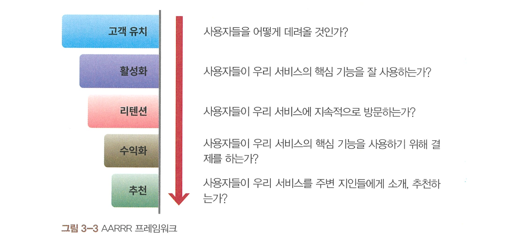

# 03장. AARRR

### AARRR 개요

**1. 지표를 바라보는 관점: 과업 기반(Task-based) vs 프레임워크 기반(Framework-based)**
- 그로스 해킹은 핵심 지표를 찾고, 그 지표를 성장시키는 방법을 찾는 활동
    - 지표를 측정하고 관리하는 방법: 1. `과업 기반` 2. `프레임 기반`

**과업 기반의 지표 관리**
- 각 조직별로 담당하는 업무를 우선 정의한 후 해당 업무를 통해 발생하는 수치들을 지표화해서 관리
- 각 업무를 진행하면서 만들어지는 수치를 집계하고 모니터링하는 식의 지표 관리

- 문제점
    - 서비스 관점에서 중요한 지표/우선순위가 무엇인지 판단하기 어려움
    - 진행 중인 업무가 변경될 수 있어서 모니터링하는 지표가 수시로 달라질 수 있음
- 비효율적이지만 관행적으로 사용

**2. 효율적인 지표 관리: AARRR**
- 회사의 조직도에 따라 지표를 나눠서 관리하지 말고, **사용자의 서비스 이용 흐름**에 따라 단계별 주요 지표를 전체 서비스 관점에서 정의
- 프레임 워크: AARRR
    - 고객 유치(Acquisition), 활성화(Activation), 리텐션(Retention), 수익화(Revenue), 추천(Referral)

**3. AARRR에 대한 오해**
- AARRR에 해당하는 5개 단계가 있고, 각 단계별로 지표를 모니터링하라는 것이 아닌가?
    - 단순히 모니터링에 그치지 않음. 입체적인 지표
- 5개 카테고리는 연결되어 있으니까 맨 앞에 있는 고객 유치부터 개선하면 되지 않나?
    - 활성화와 유지율을 가장 우선으로 개선하고, 그당므으로는 고객 유치와 추천을 개선, 마지막으로 수익화를 챙겨야 한다고 제안

**4. AARRR을 활용하는 방법**
- 각 단계별로 풀어야 하는 문제 확인
- 각 단계의 핵심이 되는 주요 지표를 선정, 해당 지표의 현재 수준을 측정
- 측정된 지표가 가지는 의미를 이해
- 개선해야 하는 목표 수준을 정하고, 실험을 통해 단계적으로 개선

### 고객 유치(Acquisition)

**고객 유치(Acquisition)의 기본 개념**
- 고객 유치에 기여한 채널의 성과를 판단할 수 있는 모델을 만드는 것이 핵심
    - `오가닉(Organic)` 유저와 `페이드(Paid)` 유저
    - 오가닉 고객: 자발적으로 찾아오는 고객 / 페이드 고객: 비용을 집행한 마케팅 활동을 통해 찾아온 고객
    
- 오가닉/페이드 기준에 따르면 고객 유치 성과를 판단하는 기본적인 출발점
    - 자발적으로 우리 서비스를 찾아온 고객이 얼마나 많은가?
    - 유료 마케팅 채널을 얼마나 효율적으로 사용했는가?
- 하지만 실제 트래킹 서비스에서 오가닉은 '유입된 채널을 식별할 수 없는 사용자'에 가까움
    - 이러한 점을 고려하면 `식별(Identified)`과 `미식별(Unknown)`이 더 적합

- 결론적으로 고객 유치와 관련해서 풀어야하는 문제
    - 어떻게 하면 사용자의 유입 채널을 최대한 누락 없이 정확하게 추적하고
    - 각 채널별 성과를 정확히 판단할 수 있을까?

**고객 획득 비용**
- 고객 유치 과정에서의 채널별 성과는 어떤 기준으로 측정할 수 있을까?
    - `고객 획득 비용(Customer Acquisition Cost)`: 고객 한 명을 데려오기 위해 지출하는 평균 비용 
- 가장 흔한 계산 방법: 마케팅에 사용한 비용/가입한 유저 수 -> 현실에서는 실용성 떨어짐
- 각 채널/캠페인/광고별로 얼마의 예산을 집행했고 각 경로를 통한 유입이 어떻게 되는지 정확히 추적할 필요가 있음
    - 웹에서는 `UTM 파라미터`, 앱에서는 `어트리뷰션`이 그 역할

**UTM 파라미터**
- 소스(Source): 웹 트래픽에서는 유입 효과를 판단하기 위한 장소 정보
- 캠페인(Campaign): 어떤 내용을 보고 온건지 파악
- 매체(Medium)
    - 온라인에서는 어떤 파라미터가 달린 URL로 접속했는지 확인해서 정보를 정확하게 파악 가능

`UTM 파라미터`
- 서비스로 인입된 트래픽이 어느 경로를 통해 들어왔는지 출처를 확인할 수 있도록 URL 뒤에 추가된 파라미터

**모바일 앱 어트리뷰션**
- 모바일 앱에서의 유입 기여를 살펴볼 때 사용
    - 애드저스트, 브랜치, 코차바, 에어브릿지, 애드브릭스 등이 있음

`어트리뷰션 윈도우`
- 기여 이벤트가 발생한 이후 얼마만큼의 기간 동안 발생한 전환에 대해 어트리뷰션을 인정할 것인가를 의미하는 용어
- 기여 채널의 성과를 판단하기 위해서는 기여 이벤트가 발생한 후 어느 정도의 기간 내에 발생한 어트리뷰션을 해당 채널의 성과로 인정할 것인가에 대한 기준 필요

**어트리뷰션 유형: 클릭-스루와 뷰-스루**
- `클릭-스루`: 클릭을 통해 발생하는 기여
- `뷰-스루`: 조회를 통해 발생하는 기여
    - 보통 클릭-스루의 어트리뷰션 윈도우는 뷰-스루의 어트리뷰션 윈도우 대비 길게 가져감 

**어트리뷰션 모델**
- 여러 개의 어트리뷰션 접점이 발생하는 경우에는 기여도에 대한 판단을 내릴 수 있게 하는 일종의 기준이 필요 -> `어트리뷰션 모델`
    퍼스트 클릭, 라스트 클릭, 선형, 타임 디케이, U자형 등

- 퍼스트 클릭 모델: 여러 건의 기여 이벤트가 발생했을 때 그중 첫 번째 매체의 성과를 100% 인정하는 방식의 어트리뷰션을 의미 
- 라스트 클릭 모델: 맨 마지막 상호작용에 기여한 매체의 성과를 100% 인정하는 방식
- 선형 어트리뷰션 모델: 접점이 발생하는 모든 매체에 동일한 가중치 부여 
- 타임 디케이: 기여한 모든 채널의 어트리뷰션 기여도를 인정하지만 시간의 흐름에 따라 가중치 부여
- U자형: 시간의 흐름에 따른 기여도 가중치를 인정하지만 가장 먼저 발생한 기여 이벤트와 최근 발생한 기여 이벤트에 동일한 가중치

 
- 어트리뷰션을 잘 활용하기 위해서는 정량적으로 나타나는 수치 외에도 각 마케팅 채널이 어떤 지면을 가지고 있는지, 어떤 사용자층을 보유하고 있으며, 어떤 식으로 사용자를 타겟팅하는지, 광고와 사용자의 인터랙션이 어떤 식으로 이뤄지는지 등 채널의 특성을 잘 이해하고 있어야 함

**딥 링크와 디퍼드 딥 링크**
- `딥 링크`: 모바일 앱 안의 특정 화면으로 이동하는 링크
    - 링크를클릭하는 사람의 휴대폰에 해당 앱 설치가 되어 있을 때만 정상적으로 동작한다는 한계 있음
- `디퍼드 딥 링크`: 모바일 앱 설치 유무와 상관없이 사용할 수 있는 딥 링크를 의미

**고객 유치 정리**
- 많은 마케팅팀에서 빠지기 쉬운 함정 중 하나가, 고객 유치 성과가 정체된 것처럼 느껴질 때 기존 채널에 대한 최적화를 고민하기보다는 새로운 채널을 찾고 테스트하는 데 지나치게 많은 리소스를 쓰는 것
- 채널 확장은 예산이 아니라 채널의 포화도를 바탕으로 결정
