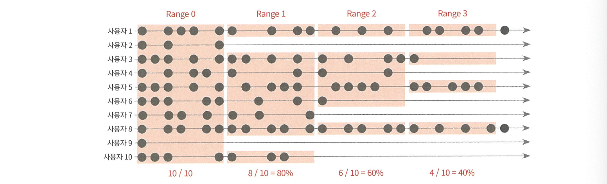

# 03장. AARRR

## 리텐션(Retention)

`리텐션`
- 활성화 과정을 통해 경험한 핵심 가치를 꾸준히 경험하게 하고, 그 수준을 측정할 수 있는 지표를 정의하고 관리해아 함
- 잘 하고 있을 때일수록 더 세심하게 측정하고 관리해야 하는 지표
- 주요 이벤트는 시간의 흐름에 따라 반복 여부를 살펴보는 것이 주용(일반적으로 접속)
    - 상품 페이지 5개 이상 방문, 구매하기 클릭, 구매 완료, 재구매, 친구 초대, 메세지 주고 받기, 콘텐츠 시청 등

**리텐션을 측정하는 세 가지 방법**

`클래식 리텐션`
- 특정일에 이벤트를 발생시킨 유저의 비율을 계산하는 방식(=Day N 리텐션)
- 측정하고자 하는 이벤트가 처음 발생한 날짜를 기준으로, 시간이 지남에 따라 몇 명이 해당 이벤트를 반복했는지 집계
- 특정일의 노이즈에 민감하고 일 단위 로그인 데이터 모두 필요
- 매일 접속해서 사용할 것으로 기대되는 서비스에 적절한 지표
    - 메신저, SNS 등


`범위 리텐션`
- 특정 기간에 이벤트를 발생시킨 유저의 비율을 계산
- 설명하기 쉽고 직관적, 측정일에 따른 노이즈가 작음
- 기준이 되는 시간이 길어질수록 리텐션이 과대 추정될 수 있고 리텐션 트렌드를 확인하는데 오랜 시간이 필요
- 굳이 매일 접속하지 않더라도 일정 간격으로 꾸준히 사용하는 서비스에 적합
    - 가계부, 음식배달 서비스 등


`롤링 리텐션`
- 더 이상 해당 이벤트가 발생하지 않을 비율은 얼마인가? -> 마지막 로그인 날짜를 활용해 리텐션 계산
- 계산에 필요한 데이터가 간단하고 계산 자체도 쉬움
- 단 한 번이라도 로그인하는 경우 그 이전까지의 모든 기간을 활동한 기간으로 인정하는 특성 때문에 과대 추정되는 경향 있음


`인게이지먼트(Engagement)`
- 인게이지먼트 = DAU/MAU
- 매일 동일한 사용자가 반복적으로 들어오는지 혹은 날마다 새로운 사용자가 들어오는지를 빠르게 가늠
- 사용자들이 꾸준히 들어와서 주기적으로 사용하는 서비스에 적합


### 리텐션 분석하기

**코호트에 따른 차이 살펴보기**
- 리텐션을 분석할 때도 코호트에 따른 차이를 확인하고 원인 규명이 중요
    - 리텐션은 쪼개서 볼 때 의미 있는 지표
- 활용하는 코호트의 기본은 날짜
    - 가입 월별 리텐션, 첫 구매 월별 리텐션 등

**리텐션 차트**
- 차트를 만들면 코호트에 따라 리텐션이 어떻게 움직이는지 시각화해서 확인 가능


- 리텐션 차트를 통해 유용한 인사이트를 얻으려면 차트를 통해 다음 질문의 답을 찾아야 함 
```
- 하나의 코호트 안에서 기간에 따른 유지율을 봤을 때 그 추이가 어떠한가? 대략 어느 정도 기간이 지나야 안정화된다고 볼 수 있는가?
- 서로 다른 코호트의 동일한 기간의 유지율을 비교하면 어떠한가?
- 기간에 따라 나눈 코호트의 규모는 어떻게 달라지고 있는가? 
```

### 리텐션 개선하기
- 리텐션 개선 방법은 시점에 따라 크게 두 가지
    - 초기에 리텐션이 떨어지는 속도를 늦추기
    - 리텐션이 안정화된 후에는 기울기를 평평하게 유지해서 오래 유지되게 하기

1. 초기에 리텐션이 떨어지는 속도 늦추기
- `활성화` 프로세스의 영향을 많이 받음
- 단계별로 쪼개서 살펴보는 것이 좋음
- `NUX(New User Experience)`: 신규 사용자 경험이라고 부르는 영역

2. 리텐션이 안정화되는 단계
- 사용자와의 관계 유지가 중요
- 정기적인 커뮤니케이션 플랜, CRM 마케팅 활동, 주기적인 프로모션, 리마케팅 등
- 한 번 떨어진 리텐션은 끌어올리기 쉽지 않기 때문에 **축적되는 가치**를 만드는 것이 중요
    - 노션 등 메모 서비스

## 수익화(Revenue)

### 수익화 관련 주요 지표

`ARPU(Average Revenue Per User)`
- Revenue / User: 사용자 한 명이 평균적으로 발생시키는 매출
- 기간을 더 명확하게 정의한 형태의 지표 사용
    - ARPDAU = 일매출/DAU
    - ARPWAU = 주간매출/WAU

`고객 생애 가치(LTV)`
- 한 명의 사용자가 진입하는 순간부터 이탈하는 순간까지의 전체 활동 기간에 누적해서 발생시키는 수익으로 정의

- 논리적으로는 완벽하지만 현실적으로는 계산 불가능 

`고객 생애 매출(LTR)`
- 고객 한 명에 대한 기대 매출
- 고객 생애 가치를 계산할 땐 매출과 비융 모두 고려해야하지만, 고객 생애 매출은 매출만 고려하면 됨 

### 수익화 분석하기
- 실제 서비스에서는 매달 새로운 사용자와 이탈 사용자가 뒤섞여서 나타나기 때문에 조건이 훨씬 까다로움
- 코호트를 잘 나누고 **코호트별 고객 생애 매출의 추이 변화**를 살펴보는 편이 훨씬 유용 
- 건강하게 성장하고 있는 서비스라면 LTR이 CAC를 빠르게 따라잡고 정기적으로 CAC의 몇 배수까지 높아져야 함

**고객 생애 매출(LTR)이 고객 획득 비용(CAC)보다 충분히 큰가?
- 일반적으로 고객 생애 매출이 고객 획득 비용의 5~10배 정도는 돼야 안정적인 서비스 운영을 기대할 수 있음
- 고객 생애 매출이 고객 획득 비용을 넘어서기까지 기간(paybac period)도 고려해야 함

**수익화 쪼개서 보기**
1. 아이템별 매출의 합계
2. 사용자별 매출의 합계
3. 결제자 수 X ARPPU

`월별 반복 매출(MRR)`
- 독립적인 결제 이벤트가 발생하는 서비스가 아닌 구독형 서비스에서는 매출을 어떻게 분석할 수 있을까?
    - 월별 반복 매출
```
- 기준(Base) MRR: 전월 기준 매출  
- 신규(New) MRR: 신규 고객으로 인해 증가한 매출  
- 이탈(Churn) MRR: 기존 고객 이탈로 인해 감소한 매출  
- 업그레이드(Upgrade) MRR: 기존 고객 대상 크로스셀(cross-sell), 업셀(up-sell)로 인해 증가한 매출  
- 다운그레이드(Downgrade) MRR: 기존 고객의 요금제 하향조정(plan downgrade) 등으로 인해 감소한 매출  
``` 

### 수익화 정리
- 대표값의 한계: 평균값으로는 실제 수익화 정도 파악 어려움 → 사용자별 편차 큼
- 파레토 법칙: 상위 20%가 매출 80% 담당 (게임 등은 상위 1%가 50% 이상 차지하기도 함)
- 평균값 주의: 고액 결제자 몇 명의 변화가 ARPU·ARPPU에 큰 영향 → ‘평균 사용자’ 개념은 위험

## 추천(Referral)

`추천(Referral)`
- 오가닉(Organic) 유입의 하나로 기존 사용자의 추천이나 입소문을 통해 새로운 사용자를 데려오는 것
- **'서비스 내에 입소문을 통한 선순환 구조를 어떻게 구축할 것인가'**라는 구조적인 문제

**친구 초대 플로 설계**

1. 설계 중요성
- UX에 따라 성과 차이 큼
    - 에어비앤비: “친구를 초대하고 25달러 받기” → “친구에게 25달러 선물하기” → 초대 수 크게 증가
2. 초대 맥락
- 단순 기능 제공만으로는 참여 유도 어려움
- 초대 맥락을 자연스럽게 구성 → 게이미피케이션 요소 활용 가능
    - 카카오뱅크 사례: 모임통장 기능 → 자연스러운 초대 유도, 신규 고객 유입 (30% 신규)
3. 메시지/보상
- 보상: 쿠폰, 적립금, 포인트, 기프티콘, 현금성 보상 등 다양
- 반드시 현금성일 필요는 없음 → 업그레이드 혜택도 가능
    - Dropbox: 저장공간 제공 → 참여↑
- 최근 트렌드: 현금에 가까운 보상 
4. 온보딩 프로세스
- 초대 메시지 → 앱 설치/가입까지 과정 중요
- 일반 유입보다 초대 유입은 전환율↑
- 온보딩 세밀 설계 → 초대 효과 극대화
    - 에어비앤비: 초대한 친구의 프로필/혜택 강조 → 전환율↑

**바이럴 계수(Viral Coefficient)**


바이럴 계수를 높이기 위해 충족되어야 하는 조건
- 친구 초대와 같은 추천 액션에 참여하는 사융자의 비율 높이기
- 한 사람이 평균적으로 초대하는 친구의 수 늘리기
- 초대받은 친구가 가입으로 전환되는 비율 높이기

# 04장. 지표 

### 지표의 속성 이해하기

- 지표를 속성에 따라 분류하면 스톡(Stock) 형태의 지표와 플로(Flow) 형태의 지표로 구분 가능

`스톡(Stock)`
- 저량 지표, 특정 시점의 스냅샷에 해당하는 지표 

`플로(Flow)`
- 시작과 끝에 대한 시간 범위가 존재하며, 일정한 시간 동안의 변화량을 나타내는 지표 

### 지표를 명확하게 정의하기
1. 문제 상황
- 데이터 분석에서 자주 받는 질문: “우리 서비스의 MAU가 얼마인가요?”
- MAU (Monthly Active User): 개념 정의는 명확하지만, 실제로 측정하는 **조작적 정의(Operational Definition)**가 불명확하면 혼란 발생

2. 필요성
- 지표 측정 기준의 불명확성은 팀 내 의사소통 혼란을 초래
- 동일 지표라도 Google Analytics, Firebase, 자체 DB 등 툴마다 측정 방식이 달라 수치가 다르게 나옴
    - MAU를 어떻게 정의하고 측정할지 명확한 기준 필요

3. 결제 전환율 예시
- 결제 전환율을 측정할 때도 조작적 정의가 없으면 혼란 발생
- 가능한 정의들
    - 결제한 회원 수 ÷ 누적 가입자 수
    - 오늘 결제한 회원 수 ÷ 오늘 로그인한 회원 수
    - 결제 세션 수 ÷ 결제하기 버튼 클릭 수
- 정답은 없음 -> 서비스/팀 상황에 따라 적절한 측정 기준을 합의해야 함

### 허무 지표에 빠지지 않기

**좋은 지표의 조건**
- Actionable 해야 함 -> 지표 기반으로 행동·계획·실험·학습 가능해야 의미 있음

`허무 지표(Vanity Metric)`
- 실제로 중요한 수치와 무관한 지표
- 단순히 “많은 일을 했다”는 착각을 주는 지표
- 서비스 방향성을 알려주지 못함
    - 누적 다운로드, 누적 방문자, 페이지 뷰

**문제점**
- 서비스 성공/실패와 무관
- 쉽게 변화 가능 -> 실제 성과와 상관없이 포장 효과

### 전체 관점에서의 최적화

- 지표 개선은 부분 최적화가 아니라 전체 관점에서 이루어져야 함
- 잘못된 최적화 예: CTR(Click Through Rate)만 높이는 데 집중 → 전체 전환율 저하
- CPC(Cost Per Click)만 보고 판단 → 광고 성과를 잘못 해석할 위험

**CPC vs 실제 성과**
- CPC는 낮을수록 좋다고 생각하지만, 클릭의 질이 다름
 - 페이스북 광고 CPC 1000원 (상품 관심 높은 사용자 유입), 배너 광고 CPC 500원 (우연히 클릭한 사용자 비율 높음)
- CPC만으로 성과 판단 불가 ->  ROAS(광고 수익률), LTV와 함께 봐야 함

**ROAS의 한계와 고려사항**
- ROAS도 절대적 기준 아님 -> 매출 집계 범위, 기간, 환불 여부 등 정의에 따라 달라짐
- 구매 이후 장기적 활동(LTV)까지 고려해야 진짜 성과 측정 가능

**Activation & UX의 중요성**
- 전체 최적화는 광고뿐 아니라 **사용자 경험(Activation)**까지 포함해야 함
- 부분 지표만 개선하는 기능 → 장기적으론 부정적 영향 가능
- 사례
    - 페이스북 "손 흔들기" 버튼 → CTR은 높았으나, 실수 클릭·불편 경험 유발
    - 텔레그램 알림 메시지 → DAU 증가했지만 사용자 불만↑ → 탈퇴로 이어짐

**넛지(Nudge) 전략**
- 간단한 알림·기능으로 DAU는 쉽게 증가 가능
- 하지만 사용자 만족도·장기적 충성도에 긍정적 영향인지 반드시 검토 필요

### 심슨 패러독스(Simpson's Paradox)

`심슨 패러독스(Simpson's Paradox)`
- 전체 데이터를 놓고 보면 잘 드러나지 않는 특성이, 데이터를 쪼개서 분석할 때 명확히 드러나는 경우
- 부분 데이터에서의 관계와 전체 데이터에서의 관계가 정반대로 나타나는 현상

## OMTM(One Metric That Matters)

### 지금 가장 중요한 지표는 무엇인가?

`OMTM(One Metric That Matters)`
- OMTM의 가치는 구성원들이 바라보는 방향성을 일치시키고 자원을 집중하는 데서 나옴
- 정의하기 위해 해야하는 질문 
    - 어떤 비즈니스 모델을 가진 서비스를 만들고 있는가?  
    - 서비스 라이프 사이클을 고려할 때 우리는 어떤 단계에 있는가?  
    - 지금 가장 신경 쓰이는 단 하나의 문제를 찾아보자. 어떤 문제인가?  
    - 우리가 원하는 행동을 하는 사용자와 그렇지 않은 사용자는 무엇이 가장 다른가?  
    - 위 4를 구분할 수 있는 이벤트나 속성은 무엇인가? 그 추세가 달라지는 지점은 어디인가?  

### OMTM & KPI & OKR

**OMTM VS KPI**

`OMTM`
- 성장을 목표로 하는 지표
- 단순히 결과뿐 아니라 결과를 달성하는 과정에도 의미가 있음
- 서비스의 성장과 직결됨 -> 서비스가 잘 되고 있는지를 보여줌
- 모든 조직원이 공유하는 하나의 목표
- 시간이 지나면서도 계속 바뀔 수 있음
- 협력을 유도함

`KPI(Key Performance Index)`
- 평가를 위한 지표
- 특정 팀/부서 단위에서 서로 다르게 설정됨
- 달성 여부 자체가 중요 -> 목표에 가까운 지표
- 한 번 정해지면 평가할 때까지 잘 안 바뀜
- 부서 간 경쟁을 유도하거나 충돌 가능성 있음
- KPI 달성 ≠ 서비스 성장 보장

